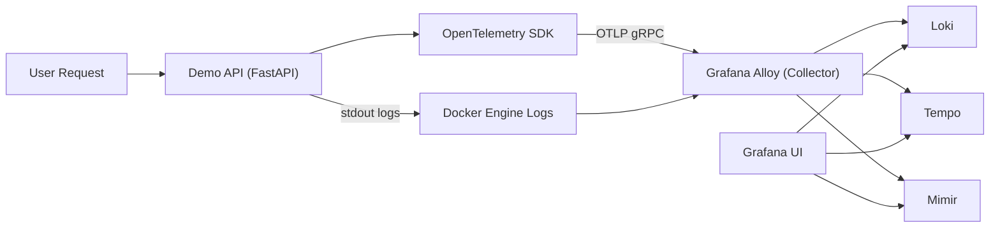
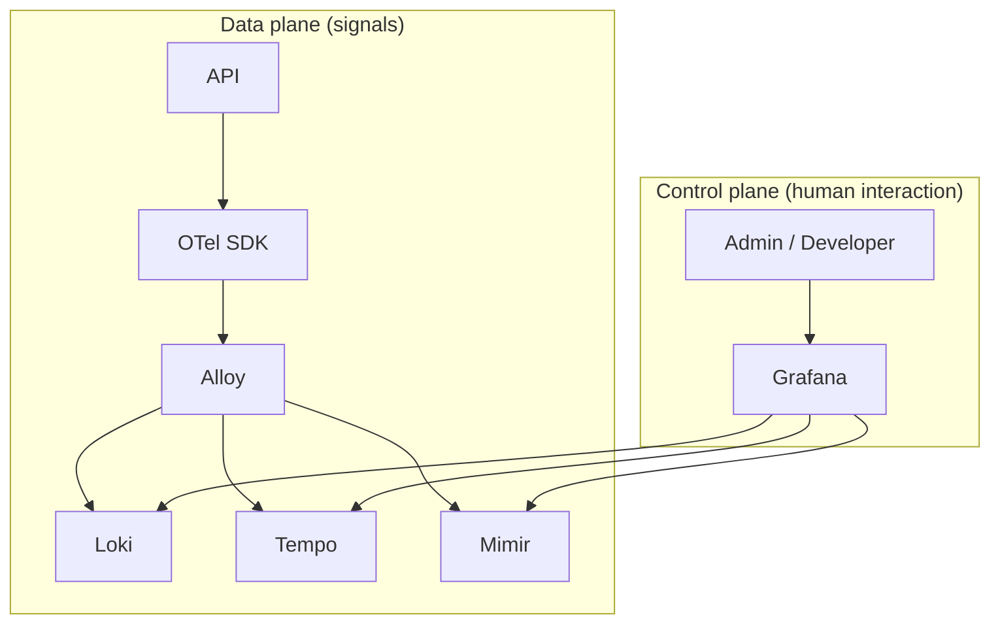
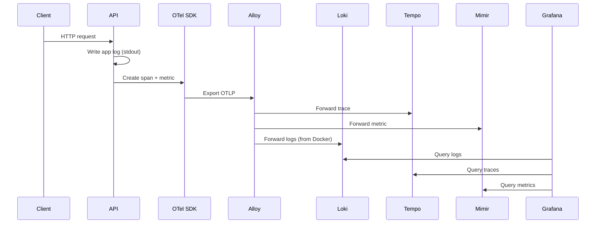
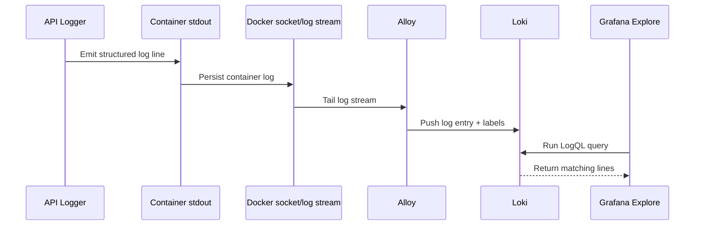
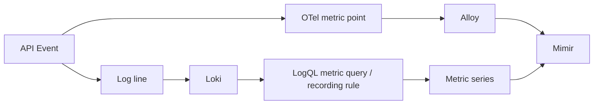
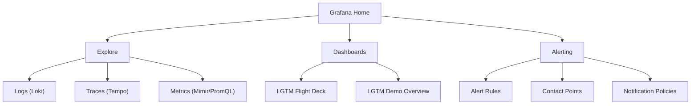

# LGTM Architecture Companion

This document is a visual companion for the video and blog post.
It focuses on *why things exist* and *how signals move*, without turning into a tutorial.

## 1) LGTM: what is what

| Component | Primary role | Signal type |
| --- | --- | --- |
| Loki | Log storage and query engine | Logs |
| Grafana | UI, correlation, dashboards, alerting | Reads all |
| Tempo | Distributed tracing backend | Traces |
| Mimir | Time-series metrics backend | Metrics |
| Alloy | Collection and routing pipeline | Ingest + forward |
| OpenTelemetry | Vendor-neutral instrumentation standard | Logs, metrics, traces |

## 2) LGTM + OTel in one picture

## 3) How components connect (control vs data)

## 4) OpenTelemetry vs plain logging

OpenTelemetry does not replace logs. It standardizes telemetry production and export.

- Logging only: "something happened" (text/event).
- OTel traces: "where the request went and where it slowed/fail".
- OTel metrics: "how often/how much over time".
- All three together: fast diagnosis instead of guessing.

## 5) Log journey: from point A to Grafana

## 6) "How does a log become a metric?"

Short answer: by default, it does not magically become a metric.

There are two valid paths:

1. App emits metrics directly with OTel SDK (recommended baseline).
2. You derive metrics from logs with LogQL queries/recording rules (useful for legacy systems).

## 7) Grafana screen map (quick orientation)

## 8) The 60-second debugging path

When something breaks:

1. Check `Dashboards` for spikes and blast radius.
2. Go to `Explore > Metrics` to confirm error/latency trend.
3. Go to `Explore > Logs` and filter by service + `ERROR`.
4. Jump to `Explore > Traces` for one failing request path.
5. Validate if alert should fire (or why it did not).
