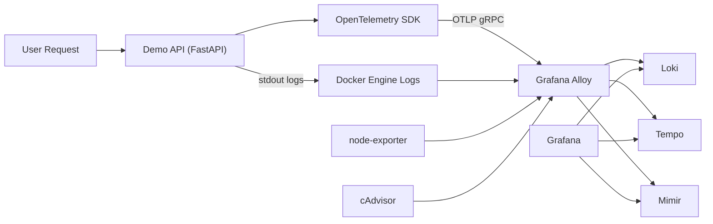

# Project Guide

This is the consolidated technical reference for the repository.
It replaces the previous scattered technical docs with one place for:

- architecture and signal flow
- Grafana navigation and dashboard explanations
- ready-to-paste queries
- local and VPS runbooks
- security and troubleshooting
- project context for future evolution

## 1. Quick Map

If you only need the shortest possible orientation:

- `docker/` contains Compose files, Grafana provisioning, and backend configs
- `api/src/api/infrastructure/telemetry.py` configures OpenTelemetry
- `api/src/api/presentation/http.py` emits request logs and app metrics
- `README.md` is the fastest way to boot the project
- this file is the deeper reference once the stack is running

## 2. Architecture And Signal Flow

### Core components

| Component | Primary role | Signal type |
| --- | --- | --- |
| Loki | Log storage and query engine | Logs |
| Grafana | UI, dashboards, Explore, alerting | Reads all |
| Tempo | Trace storage backend | Traces |
| Mimir | Time-series backend | Metrics |
| Alloy | Collector and router | Ingest + forward |
| OpenTelemetry | Instrumentation standard | Metrics + traces |
| node-exporter | Host metrics exporter | VPS metrics |
| cAdvisor via Alloy | Container metrics exporter | Container metrics |

### High-level flow



### What actually happens in this project

- Logs: `API -> stdout -> Docker -> Alloy -> Loki -> Grafana`
- App metrics: `API -> OpenTelemetry -> Alloy -> Mimir -> Grafana`
- App traces: `API -> OpenTelemetry -> Alloy -> Tempo -> Grafana`
- Host metrics: `node-exporter -> Alloy -> Mimir -> Grafana`
- Container metrics: `cAdvisor -> Alloy -> Mimir -> Grafana`

### Where custom signals live

- Telemetry bootstrap: [telemetry.py](/Users/luizotavio/Desktop/tutoriais_e_cursos/lgtm1/api/src/api/infrastructure/telemetry.py)
- HTTP scenario flow: [http.py](/Users/luizotavio/Desktop/tutoriais_e_cursos/lgtm1/api/src/api/presentation/http.py)
- App startup: [main.py](/Users/luizotavio/Desktop/tutoriais_e_cursos/lgtm1/api/src/api/main.py)

### Custom telemetry pattern

If you want to create your own signals later, the pattern is:

1. Create metrics instruments once.
2. Record them in request or business flow.
3. Add useful attributes like endpoint, status, and mode.
4. Create manual spans only around business steps that matter.

Minimal example:

```python
retries_counter = meter.create_counter(
  name="demo_api_retries_total",
  description="Retry attempts by endpoint.",
  unit="{retry}",
)

retries_counter.add(1, attributes={"endpoint": "/checkout", "status": "retry"})
```

## 3. Grafana Workflow

### First click path

Use this order while exploring or recording:

1. `Connections > Data sources`
2. `Dashboards > LGTM Demo > LGTM Demo Overview`
3. `Dashboards > LGTM Demo > LGTM Flight Deck`
4. `Dashboards > LGTM Demo > VPS Health`
5. `Explore > Loki`
6. `Explore > Tempo`
7. `Alerting > Alert rules`

### Talk track

- "Before reading charts, confirm the signal pipelines are alive."
- "Overview gives the API health story."
- "Flight Deck gives the richer operational story."
- "VPS Health tells me whether the machine itself is suffering."
- "Explore is where I leave the dashboard and investigate."

## 4. Dashboard Guide

### LGTM Demo Overview

Use this dashboard when you want the shortest API story possible.

Panels:

- `Request Rate by Status`
  Meaning: requests per second split into `ok`, `warn`, `slow`, and `error`
- `Error Ratio (%)`
  Meaning: percentage of traffic that is failing
- `API Delay (ms)`
  Meaning: `p50` and `p95` latency from the request duration histogram
- `Scenario Logs`
  Meaning: raw FastAPI scenario logs from Loki

Suggested narration:

- "Traffic, error ratio, latency, then logs."

### LGTM Flight Deck

Use this dashboard when you want a fuller operational story with volume,
quality, latency, and logs in one screen.

Filters:

- `Scenario mode`: filter by scenario behavior
- `Log keyword`: reduce Loki noise with free text

Panels:

- `Total Requests`
  Meaning: total requests in the selected range
- `Request Rate by Status`
  Meaning: current request rate by scenario status
- `Average Request Duration (ms)`
  Meaning: average latency in milliseconds
- `Total Exceptions`
  Meaning: total error requests in the selected range
- `Healthy Request Ratio`
  Meaning: proportion of non-error requests over time
- `Error Request Ratio`
  Meaning: proportion of error requests over time
- `P99 Request Duration (ms)`
  Meaning: latency tail by endpoint
- `Short-Window Request Rate`
  Meaning: near-real-time request rate using a 10 second window
- `Request Per Sec`
  Meaning: stable overall throughput using a 1 minute window
- `Log Type Rate`
  Meaning: log volume by severity over time
- `Log of All FastAPI App`
  Meaning: formatted application logs with scenario, HTTP status, delay, trace id, and detail

Suggested narration:

- "Top row is volume and average behavior."
- "Middle row is service quality."
- "Bottom row is latency tail, throughput, and evidence in logs."

### VPS Health

Use this dashboard to separate application pain from machine pain.

Panels:

- `CPU Used (%)`
- `Memory Used (%)`
- `Disk Used (%)`
- `Network Throughput (B/s)`
- `CPU and Memory (%)`
- `Network RX/TX (B/s)`
- `Disk Used (%)` over time

Suggested narration:

- "This dashboard answers whether the host itself is under pressure."

## 5. Ready-To-Paste Queries

Use Grafana `Explore` and pick the relevant data source before pasting.

### PromQL (Mimir)

Request rate by status:

```promql
sum(rate(demo_api_requests_total[1m])) by (demo_scenario_status)
```

Error ratio:

```promql
100
  * sum(rate(demo_api_requests_total{demo_scenario_status="error"}[5m]))
  / clamp_min(sum(rate(demo_api_requests_total[5m])), 0.0001)
```

P50 latency:

```promql
histogram_quantile(0.50, sum(rate(demo_api_response_delay_ms_milliseconds_bucket[5m])) by (le))
```

P95 latency:

```promql
histogram_quantile(0.95, sum(rate(demo_api_response_delay_ms_milliseconds_bucket[5m])) by (le))
```

P99 latency:

```promql
histogram_quantile(0.99, sum(rate(demo_api_response_delay_ms_milliseconds_bucket[5m])) by (le))
```

Total requests by scenario mode in the last 30 minutes:

```promql
sum(increase(demo_api_requests_total[30m])) by (demo_scenario_mode)
```

Host CPU used:

```promql
100 * (1 - avg(rate(node_cpu_seconds_total{job="node-exporter", mode="idle"}[5m])))
```

Host memory used:

```promql
100 * (1 - (
  node_memory_MemAvailable_bytes{job="node-exporter"}
  / node_memory_MemTotal_bytes{job="node-exporter"}
))
```

Host disk used:

```promql
100 * (1 - (
  sum(node_filesystem_avail_bytes{job="node-exporter", fstype!~"tmpfs|overlay|squashfs|ramfs"})
  / sum(node_filesystem_size_bytes{job="node-exporter", fstype!~"tmpfs|overlay|squashfs|ramfs"})
))
```

Host network throughput:

```promql
sum(rate(node_network_receive_bytes_total{job="node-exporter", device!~"lo|docker.*|veth.*|br-.*"}[5m]))
  + sum(rate(node_network_transmit_bytes_total{job="node-exporter", device!~"lo|docker.*|veth.*|br-.*"}[5m]))
```

### LogQL (Loki)

All scenario logs:

```logql
{job="docker"} |= "api.presentation.http"
```

Error scenarios only:

```logql
{job="docker"} |= "api.presentation.http" |= "scenario=error"
```

Slow scenarios only:

```logql
{job="docker"} |= "api.presentation.http" |= "scenario=slow"
```

Pretty logs:

```logql
{job="docker"}
  |= "api.presentation.http"
  | logfmt
  | line_format "{{.scenario}} [{{.http_status}}] delay={{.delay_ms}}ms trace={{.trace_id}}"
```

Error log rate:

```logql
rate({job="docker"} |= "api.presentation.http" |= "scenario=error" [1m])
```

Errors in the last 5 minutes:

```logql
sum(count_over_time({job="docker"} |= "api.presentation.http" |= "scenario=error" [5m]))
```

### TraceQL (Tempo)

All API traces:

```traceql
{ resource.service.name = "lgtm-demo-api" }
```

Error traces:

```traceql
{ resource.service.name = "lgtm-demo-api" && span.demo.scenario.status = "error" }
```

Slow traces:

```traceql
{ resource.service.name = "lgtm-demo-api" && span.demo.scenario.status = "slow" }
```

Traces slower than 500ms:

```traceql
{ resource.service.name = "lgtm-demo-api" && duration > 500ms }
```

Traces for one endpoint:

```traceql
{ resource.service.name = "lgtm-demo-api" && span.demo.endpoint = "/unstable" }
```

### Signal correlation flow

Use this sequence:

1. Metric spike in Mimir.
2. Search matching logs in Loki.
3. Copy `trace_id` from a log line.
4. Open the trace in Tempo.
5. Check alert state if the issue crosses a threshold.

### Percentiles

- `p50`: typical experience
- `p95`: slow tail
- `p99`: worst tail

Why not average only:

- 99 fast requests plus 1 terrible request can still look "fine" on average

## 6. Traffic Recipes

Local:

```bash
just smoke
just traffic 50 0.1
just traffic-scenarios 20 0.1
just chaos
just calm
just o11ycheck
just rules-load
just rules-state
```

Production:

```bash
just deploy
just traffic-prod 30 0.2
just traffic-scenarios-prod 20 0.1
just chaos-prod
just calm-prod
```

## 7. Local And KVM2 Runbook

### Local startup

```bash
cp .env.example .env
just up
just smoke
just traffic-scenarios 20 0.1
```

Local URLs:

- API: `http://127.0.0.1:8000`
- Grafana: `http://127.0.0.1:3000`
- Alloy admin: `http://127.0.0.1:12345`

### KVM2 profile

This profile is tuned for:

- `kvm2`
- `8 GB RAM`
- `2 vCPU`

Topology:

- public Traefik on `80/443`
- private Grafana on `10.100.0.2:3000`
- internal-only Loki, Tempo, Mimir, Alloy, and node-exporter

Deploy:

```bash
docker compose -f docker/compose.kvm2.yaml up -d --build
```

Validation:

```bash
curl -kfsS -H 'Host: api.inprod.cloud' https://127.0.0.1/health
ss -ltnp | grep -E '(:80|:443|:3000)'
docker compose -f /opt/lgtm1/docker/compose.kvm2.yaml ps
```

Expected:

- `:80` on `0.0.0.0`
- `:443` on `0.0.0.0`
- `:3000` on `10.100.0.2`
- all services `Up`

Optional alert bootstrap on VPS:

```bash
mimir_ip=$(docker inspect -f '{{range .NetworkSettings.Networks}}{{.IPAddress}}{{end}}' mimir)
curl -fsS -X POST "http://$mimir_ip:9009/prometheus/config/v1/rules/demo" \
  --data-binary @/opt/lgtm1/docker/mimir-rules/demo-api.yaml
```

## 8. Security Checklist

Run these before publishing a real VPS:

### Firewall

```bash
sudo ufw status verbose
```

Expected:

- only `80`, `443`, `22`, and `51820` open as intended
- default inbound `deny`

### Fail2ban

```bash
sudo systemctl status fail2ban --no-pager
sudo fail2ban-client status sshd
```

### SSH policy

```bash
sudo sshd -T | grep -E 'permitrootlogin|passwordauthentication|pubkeyauthentication|maxauthtries|x11forwarding'
```

### Exposed ports

```bash
ss -ltnp | grep -E '(:22|:80|:443|:51820|:8000|:3000)'
docker ps --format 'table {{.Names}}\t{{.Ports}}'
```

### TLS

```bash
echo | openssl s_client -servername api.inprod.cloud -connect api.inprod.cloud:443 2>/dev/null | openssl x509 -noout -issuer -subject -dates
```

### WireGuard

```bash
sudo systemctl is-active wg-quick@wg0
sudo wg show
```

## 9. Troubleshooting

### Grafana shows no data

```bash
docker compose -f docker/compose.yaml ps
just smoke
```

### Traces missing

```bash
docker logs docker-tempo-1 --tail 100
docker logs alloy --tail 100
just traffic-scenarios 20 0.1
```

### Logs visible but `detected_level` is odd

```logql
{job="docker"} |= "api.presentation.http" |= "ERROR"
```

### Alert rules page fails

```bash
just rules-list
docker logs mimir --tail 120
just rules-load
just rules-state
```

### API works but traces are missing

Check:

- `OTEL_EXPORTER_OTLP_ENDPOINT`
- Alloy receiver
- Tempo logs

### Public access to Grafana should not work on kvm2

Expected profile:

- Grafana bound to `10.100.0.2:3000`
- no public `3000`

### HTTPS certificate not issuing

```bash
dig +short api.inprod.cloud
docker logs traefik --tail 200
```

## 10. Project Context Appendix

The project goal is twofold:

1. provide a technically sound LGTM baseline
2. provide a strong narrative base for educational content

Current positioning:

- local-first observability base
- clear path to one-VPS deployment
- no HA or Kubernetes in the first cut
- focus on clarity, signal flow, and reproducibility

Target audience:

- junior and mid-level developers learning observability
- developers moving toward infra/DevOps responsibilities
- people who want a reusable baseline instead of starting from zero

Key product promise:

- observability becomes easier to understand when logs, metrics, and traces are connected in a realistic but still understandable setup
